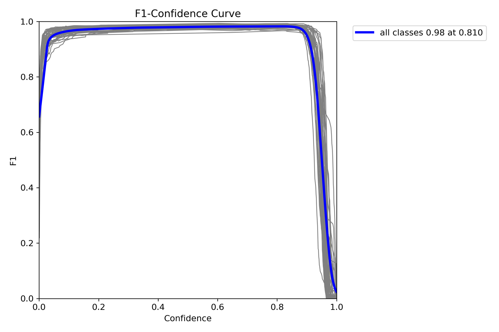

[## 🚦 Traffic Sign Recognition with YOLOv8  
**Computer Vision 2 – Heilbronn University (Summer Semester 2024)**  
**Marco Menner & Benedikt Seeger**  
**Degree Program:** Mechatronics and Robotics  

---

### 📌 Project Overview

This project presents a robust AI-based pipeline for **real-time traffic sign detection and classification**, developed as part of the "Computer Vision 2" course. The system leverages **YOLOv8n**, an efficient object detection architecture, to recognize German traffic signs under real-world conditions such as poor lighting, occlusions, and varied backgrounds.

We focused on real-time performance, robustness, and adaptability through **custom synthetic datasets**, **data augmentation**, and **multi-stage classification** (especially for speed limit signs).

---

### 🧰 Technologies & Methods

- **Ultralytics YOLOv8n** for object detection
- **Custom dataset generation pipeline**
- **Synthetic data with heavy augmentations** using OpenCV and Python
- **Two-stage classification** for speed signs
- **Real-time frame caching** to filter false positives
- Visualization through overlay UI
- **Python**, **OpenCV**, **YOLOv8**, **Matplotlib**

---

### 📦 Dataset Generation & Augmentation

#### 🧪 Synthetic Dataset

Due to limited access to labeled traffic sign scenes, we created a **custom synthetic dataset** by placing isolated traffic signs on random background scenes (using COCO dataset images). This approach allowed us to control:

- The number and types of signs per image
- Placement randomness
- Sign scaling, occlusion, and layering

#### ✨ Augmentation Techniques Applied:
Each sign undergoes random augmentation steps before being composited into the background:

- **Blur / Sharpness Reduction**
- **Perspective Distortion**
- **Brightness / Contrast Changes**
- **Color Shifts (HSV)**
- **Alpha masking** for transparency preservation

These techniques improve the model’s ability to generalize in real-world driving conditions.

##### 📸 Example: Synthetic Augmented Image  
*Insert below an example training image with multiple randomly placed, augmented signs.*

```markdown

```

---

### 🧠 Model Training & Optimization

- **Model**: YOLOv8n (Nano version for speed & efficiency)
- **Training set**: 3000+ synthetic images
- **Validation**: GTSDB benchmark + real-world dashcam footage
- **Final detection time**: **~0.06–0.09 seconds/frame**

##### 📈 F1-Score Confidence Curve
*Insert your F1-confidence curve image here*

```markdown

```

---

### ⚙️ Inference Pipeline

The detection pipeline includes:

- **Real-time detection** with YOLOv8n
- **Frame caching** to reduce false positives  
  (Sign must appear in **3 consecutive frames** to be displayed)
- **Speed limit signs** are detected, extracted, and classified in a second step for precision
- **Overlay interface** for sign visualization

##### 🖼️ Example: Inference Output  
```markdown

```

---

### 🪟 Display Strategy

- **Speed signs** are shown **large and persistent** until a new one appears
- **Other signs** rotate through a 6-sign “sign box” display
- Real-time rendering supports situational awareness for the driver

---

### 🧪 Evaluation & Testing

- **Real traffic footage** tested
- **GTSDB** included in validation set
- Evaluated via:
  - Confusion matrix
  - Detection heatmaps
  - Per-class confidence stats

---

### 🚀 Future Improvements

- Add new sign categories (e.g., construction signs, temporary restrictions)
- Detect traffic lights and state changes
- Define **Regions of Interest (ROIs)** to show only relevant signs (e.g., for turns)
- Port inference logic to **C++** for embedded, high-speed deployment

---

### 🛠️ Folder Structure

```
├── data/                   # Dataset images & labels
├── scripts/                # Augmentation, training, inference scripts
├── model/                  # Weights & model configs
├── results/                # Inference outputs and evaluation
├── images/                 # Screenshots and visual examples
├── README.md
```
